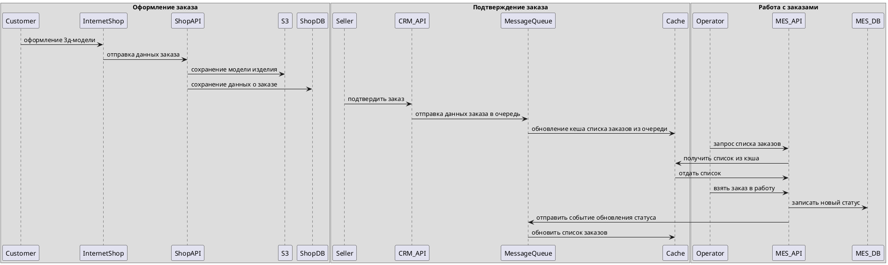

### Мотивация

Кэширование имеет смысл внедрить в тех частях/сущностях системы, к которым часто обращаются и которые не так часто меняются:

- Список заказов в CRM и MES (по крайней мере в течение дня он не будет интенсивно меняться).
- Статусы заказов: меняются нечасто, часто запрашиваются как операторами, так и клиентами
- Результаты расчёта стоимости изделий для часто используемых 3D-моделей (какие-нибудь популярные модели на свадьбу, День святого Валентина и т.д.)

Почему нужно внедрить кэширование?
- Кэширование снизит количество запросов к базе данных, что уменьшит нагрузку на неё и улучшит производительность.
- Кэширование часто запрашиваемых данных (например, списка заказов, статусов) ускорит время отклика системы для операторов и клиентов.
- Кэширование результатов расчёта стоимости в MES уменьшит время обработки запросов и затраты на ресурсы CPU.
- Быстрый доступ к данным повысит удовлетворённость клиентов и операторов.

Какие проблемы решит кэширование?
- Медленная загрузка списка заказов.
- Задержки при расчёте стоимости в MES.
- Медленное обновление статусов заказов.

### Предлагаемое решение

#### Способ кэширования
Выбираем серверное кэширование - оно позволяет централизованно управлять кэшем, что упрощает его обновление и инвалидацию.
Клиентское не подходит, так как данные довольно часто обновляются (например, статусы заказов), и синхронизация между клиентами будет сложной.

Так как у нас приложение, в котором важна консистентность данных (чтобы операторы не брали заказы, которые уже не актуальны, 
а покупатели видели актуальные статусы), можно использовать паттерн Write-Through.

Общая схема:
- Приходит запрос на добавление нового заказа / обновление статуса
- Сохраняем данные сразу в БД
- БД возвращает результат запроса
- Сохраняем данные из бд в кэш. Так кэш и БД будут консистентны
- Возвращаем результат запроса.

Диаграмма пути заказа:

#### Инвалидация
**Стратегия на основе изменений** подойдет для:
1. инвалидации кеша статуса заказа:
- CRM API или MES API изменяет статус заказа в базе данных.
- бд отправляет событие order_updated в очередь сообщений.
- слушатель событий получает сообщение и инвалидирует кэш.
2. инвалидации кеша стоимости популярных расчетов:
- в базе данных меняется информация о стоимости грамма золота или камней или в MES обновляются правила расчета
- соответствующий источник изменения отправляет события в очередь
- подписчик получает сообщение и инвалидирует кеш

**Программная инвалидация** подойдет для кеша списка заказов:
- оператор MES взял заказ в работу
- система программно инвалидирует кэш, в котором сохранен список заказов
- другие операторы увидят актуальный список заказов и не будут пытаться взять уже занятый заказ.
